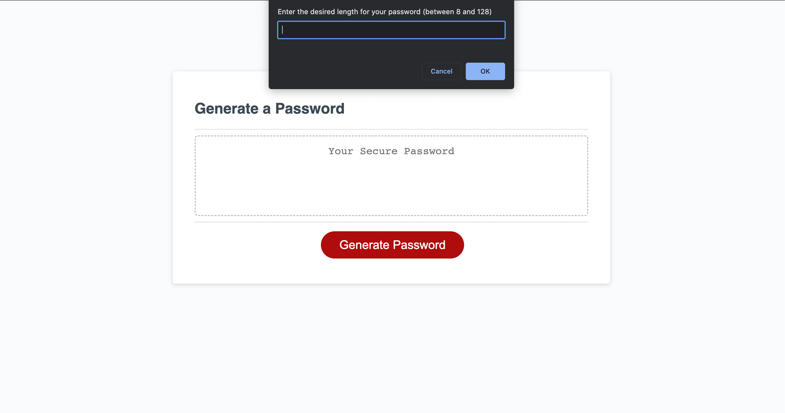

# Random-Password-Generator

## Table of Contents
- [Project Description](#project-description)
- [Screenshot](#screenshot)
- [Link](#link)
- [Credits](#credits)

## Project Description

This is a password generator that generates a password between 8 to 128 characters. User is able to choose character types they require and a randomised password will generate with the selected criteria. 

## Link

[Password Generator](https://hailin-ruan.github.io/Random-Password-Generator/)

## Screenshot

## Credits

- [Xandromus](https://github.com/coding-boot-camp/friendly-parakeet): Provded starter codes.
